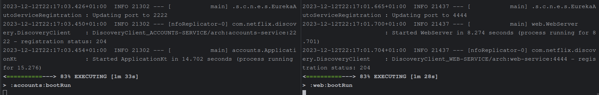
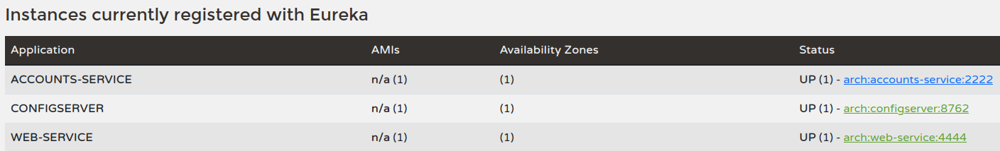
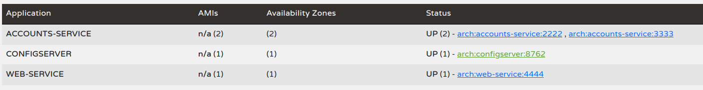
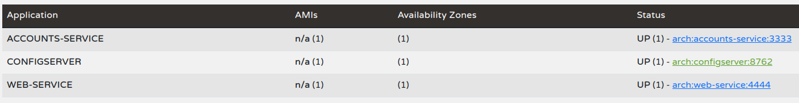
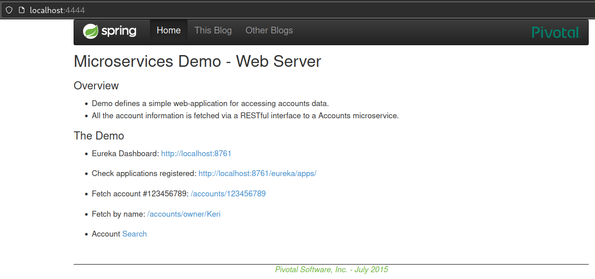
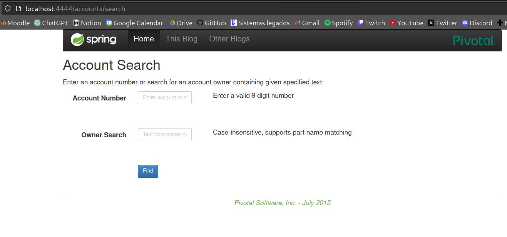
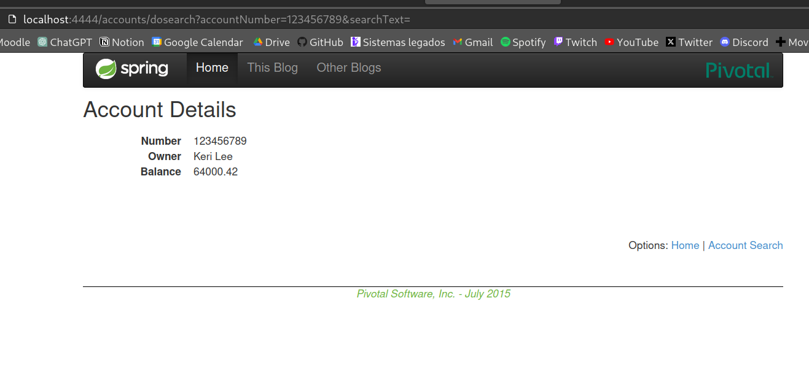

## 1. Create your own configuration repository based on <https://github.com/UNIZAR-30246-WebEngineering/lab6-microservices-config-repo>

Link to the repository:
- <https://github.com/rubenmzn/lab6-microservices-config-repo

## 2. Two services `accounts (2222)` and `web` are running and registered (two terminals)

Log screenshot of the two services running:

## 3. The service registration service has these two services registered (a third terminal)

Screenshot of the services registered at eureka server:

## 4. Update the configuration repository so that the accounts service uses now the port 3333

Commit where the configuration is changed:
- <https://github.com/rubenmzn/lab6-microservices-config-repo/commit/2ffb5f448cd721f9cb56e355f445546217539d28>

## 5. Run a second instance of the accounts service using the new configuration (a fourth terminals). What happens? 

As we can see on the Eureka dashboard, there is a second account service registered with port 3333. That is because the new service has registered as "account-service" in the registration service (Eureka).

## 6. What happens when you kill the service accounts (2222) and do requests to web?

When we kill the service accounts and send requests to `web`, it still works. That is because we had another service registered as a "account-service" in Eureka. Registering services as the same microservice with different ids(in this case, ports) gives us the resilient and fault-tolerant system we want.

## 7. Can the web service provide information about the accounts again?. Why?
Yes, it can provide information. That is because the account service implements a JPA AccountRepository and Spring REST to provide a RESTful interface through a MVC architecture. The `web` service uses RestTemplates provided by Spring that allows sending HTTP requests to a RESTful server and fetch data from the database.

